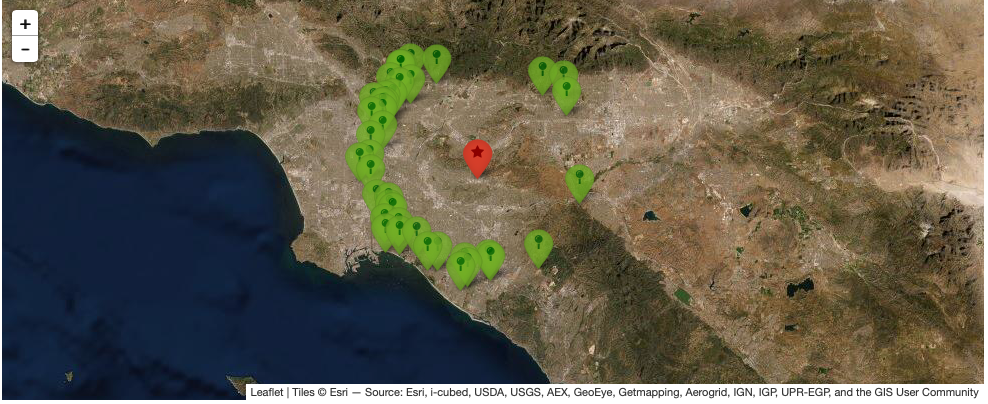

API Reference
=============

In this section, a list of commands for common tasks is presented. In tsprocess, all commands are based on a project. One needs to add a project at the beggining of each processing session. 

.. code-block:: console

    $ from tsprocess import project as pr
    $ p1 = pr.Project("Highf")

In this example, `Highf` is the project name, and `p1` is the project handle. A database with the project name with “_db.sqlite” suffix will be generated. If a database with that name already exists, it will be used to retrieve records or add new records. In the following tasks, we assume that you have `p1` project handle. 

Adding incidents
----------------
For more details about incidents, please see `Incidents <incidents.rst>`_ section. 

.. code-block:: console

    $ p1.add_incident(path_to_incident_folder)

List of available incidents
---------------------------
Each incident has a unique name, which is provided in the description.txt file (see `here <incidents.rst>`_ ). You can see a list of available incidents by using the following command:

.. code-block:: console

    $ p1.list_of_incidents()

Adding filter for selecting stations
------------------------------------
Processing the results are based on selected stations. Users can define different filters for selecting stations, the filters can be used together. In that those stations that satisfy all filters will be returned. Still working on this .... 

Adding processing label
-----------------------
In *tsprocess* we assign a unique Id for each seismic record. Any processing action is also has a unique Id. Through these unique ids (hash values) we can track any record that has been gone throught different processes. Users are not allowed to directly process any records, however, they can define processing labels and apply those labels on the records. The following command shows how to add a new processing labels. There is no limitation on the number a processing labels and it can be defined any place before it is called. 

.. code-block:: console

    $ #p1.add_processing_label(label_name,label_type, dictionary of arguments)
    $ p1.add_processing_label('lpf2','lowpass_filter',{"N":4, "fc":2.0})
  
The following table shows different label types and their required arguments. 

=================  ======================================================================  
   Label Type      Required Arguments                   
=================  ======================================================================  
 lowpass_filter     "N":order, "fc": corner frequency    
 highpass_filter    "N":order, "fc": corner frequency    
 bandpass_filter
 rotate             "angle": rotation angle in degrees
 scale              "factor": scaling factor
 shift              "amount": shifting amount in seconds
 taper              "m": number of points, "flag": "front","end","all" 
 cut                "m": number of points, "flag": "front","end", "t_diff":cut time (s)
 zero_pad           "m": number of points, "flag": "front","end", "t_diff":added time (s)  
=================  ======================================================================

- details about each label ....

Processing records
------------------
There are numerous packages for processing seismic timeseries. *tsprocess* is a platform to manage large number of stations and incidents. Therefore, one can plot a timeseries, however, with the processing labels and stations filters she can define which incidents, which stations, and what processing should be done on them before plotting the timeseries. Users never manually store any processed data. The function prototype is according to the following:

.. code-block:: console

     command(list of incidents,
              nested list of processing labels for each incident,
              list of station filters,
              dictionary of optional parameters)

Depending on the command and optional parameters, The output will be in a different format; however, in almost all commands in this format, a list of records will be extracted from the database or will be generated. 

- We track incidents with their *incident_name* attribute, which is defined by the author of the incident folder inside the *description.txt* file. 
- Each incident goes through different processing steps. For each incident, we have a list of processing labels. If it passed as an empty list, it would return the original data. Processing steps will be applied by their order in the list. The first label will be applied first.
- The intersection of different station filters will determine which station should be included in the final results. 
- Optional parameters are a dictionary container that provides control over the final results.

Optional parameters
*******************

Fine tuning the final results and storing the final results in the disk can be controlled by optional parameters. In the following a list of optional parameters and their functionality are presented. Optional parameters that are not suppported with the commands will be ignored. 

    - **zoom_in_freq**

        + parameter: a list of min and max frequency (Hz) [float, float]
        + In plots: it will apply limit on frequency axis representation. 
        + Data is not modified.

    - **zoom_in_time** 

        + parameter: a list of min and max time (s) [float, float]
        + In plots: it will apply limit on time axis representation. 
        + Data is not modified.

    - **zoom_in_rsp** 

        + parameter: a list of min and max period (s) [float, float]
        + In plots: it will apply limit on period axis representation. 
        + Data is not modified.
        

Show stations on the map
------------------------
Using leaflet API, users can take a look at stations on the map. It follows the same function signature. The following command shows the stations in distance between 25 and 30 Km from 2014 5.1 La Habra, CA, earthquake. Stations' popups shows station names.   

.. code-block:: console

    $ p1.show_stations_on_map(['hercules101'],[[]],['lesst30','moret25'])

