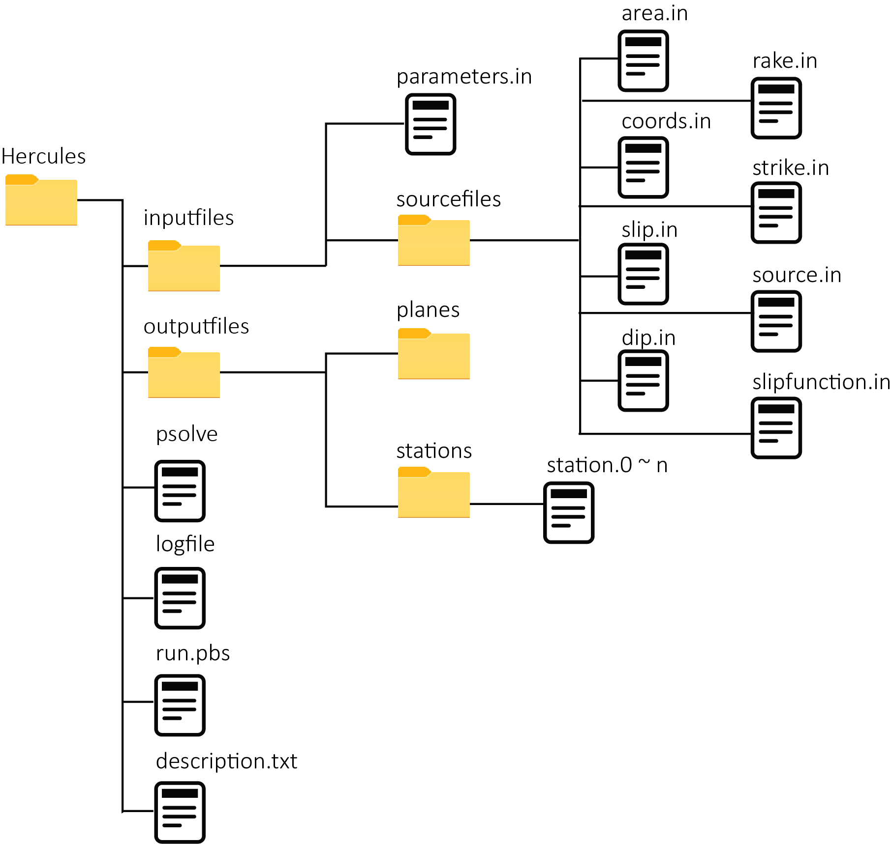

Incidents
=========
An earthquake incident (or incident for short) is a folder that includes observed or simulated earthquakes with their source and stations details. **tsporcess** parses all files inside the incident folder and extract the required data. In the following, we explain the incident folders' details for major ground motion simulation platforms. Please let `us <contact.rst>`_ know if you need to add your research group incident format into **tsporcess**.

Hercules
--------

`Hercules <https://github.com/CMU-Quake/hercules/wiki/Hercules>`_ is a simulation software for anelastic wave propagation in highly heterogeneous media due to kinematic faulting. The following figure shows the required files and folders and their arrangements.

The only extra file is **description.txt** that has two mandatory keys and values. These keys are *incident_name* and *incident_type*. The former should be a unique name and the latter, in this case, is *hercules*.

.. code-block:: console
     
    # description.txt
    incident_name         =  hercules_1
    incident_type         =  hercules
    inputfiles_parameters =  inputfiles/parameters.in
    source_hypocenter     =  lat, lon, depth(km)

RWG
---
TBD

AWP
---
TBD

